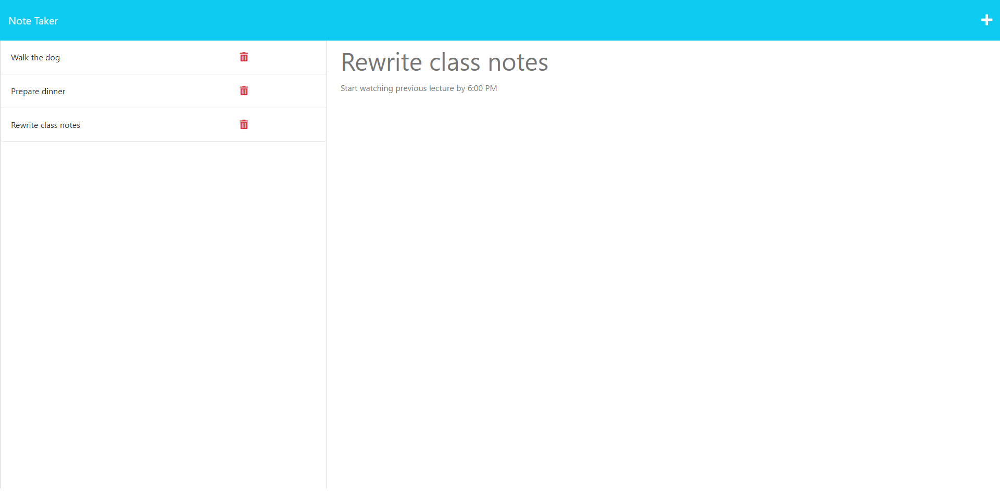

# Note-Taker

## Description
This application called Note Taker can be used to write and save notes so that the user can organize their thoughts and keep track of tasks they need to complete. When the user opens the Note Taker, they are presented with a landing page with a button link to a notes page. When the user clicks the button link, then they are presented with a page with existing notes listed in the left-hand column along with empty fields to enter a new note title and text in the right-hand column. To save a new note, the user will enter a title and the note's text which will trigger a save icon to appear in the navigation bar at the top of the page. Once the save icon is clicked, the note will appear on the left-hand column which can be clicked for the user to see its contents again on the right-hand column. Addtionally, the user can click on the plus icon in the navigation bar to be presented with empty fields to enter a new note in the right-hand column. Finally, the user can also delete any of their existing notes by clicking the respective trash icon on the left-hand column.

## Credit
Thank you to my classmates; Lucas Wysoczanski, Daniel Lee, May Pham, and Joey Lee; for partnering with me to work on this challenge. Here are their GitHub profiles-- 
Lucas Wysoczanski: https://github.com/LucasWyski001 
Daniel Lee: https://github.com/drog41813 
May Pham: https://github.com/mayphamx
Joey Lee: https://github.com/Rockojoe2

## License
This repository is licensed by MIT. See https://mit-license.org/ to learn more.

## Usage

Deployed site: https://micaella-note-taker-b4c0255632bd.herokuapp.com/

GitHub repository: https://github.com/micavilla/note-taker